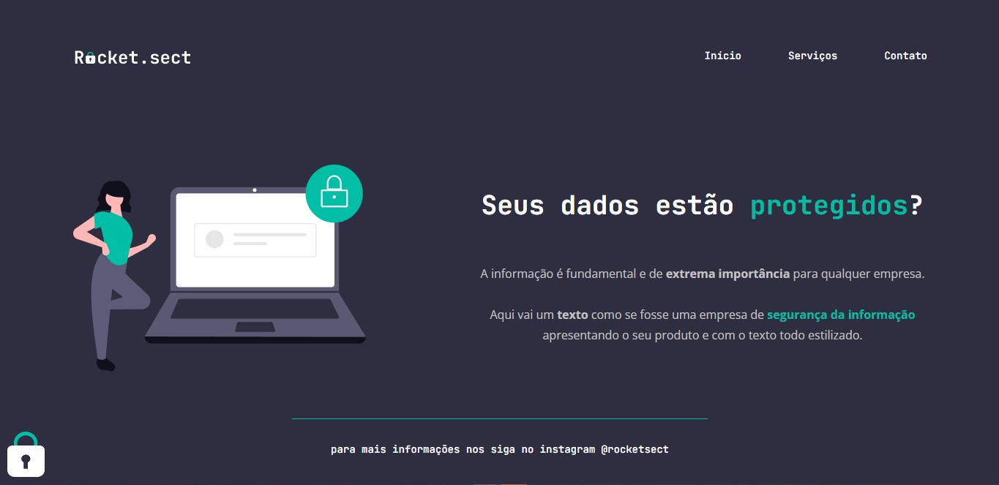

<h1 align="center">RocketSect</h1>

- [Overview](#overview)
  - [The challenge](#the-challenge)
  - [Screenshot](#screenshot)
  - [Links](#links)
- [My process](#my-process)
  - [Built with](#built-width)
- [Author](#author)

<h2 id="overview">Overview</h2>
<h3 id="the-challenge">:dart: The challenge</h3>

The project involves:

- A landing page for a security company

<h3 id="screenshot">:desktop_computer: Screenshot</h3>

<h3 id="links">:link: Links</h3>
-  Live Site URL: https://nesdark.github.io/rocket-sect/

<h2 id="my-process">:gear: My process</h2>

<h3 id="built-width">:hammer: Built with</h3>
- Semantic HTML5 markup
- CSS custom properties
- Flexbox
- Git and GitHub

<h3 id="author">:fountain_pen: Author</h3>
- Website: https://nesdark.github.io/portifolio
